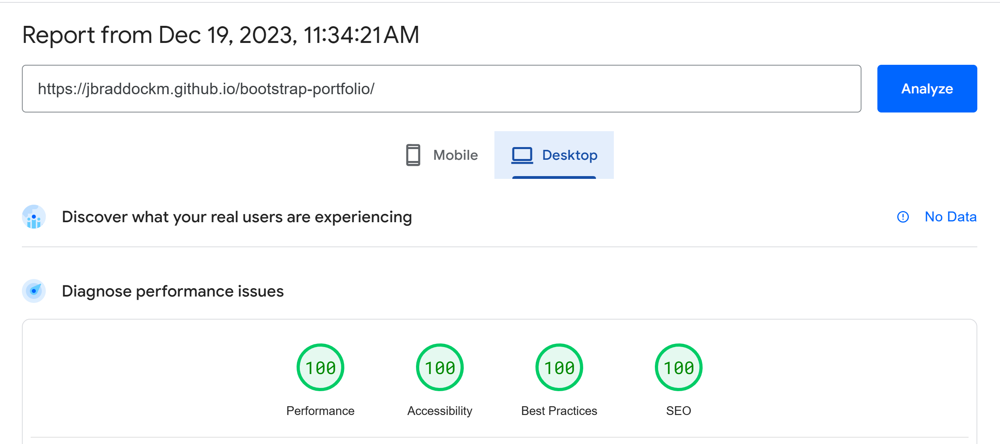

# Skills Bootcamp Module 3 - Bootstrap Portfolio Challenge

## Description

This project focuses on creating a responsive portfolio page with Bootstrap. The primary objectives include:

* **Bootstrap Components**
  * A Navigation bar
    * Include links that are applicable to your portfolio.
    * Links should navigate to the appropriate sections
  * A hero section
    * A jumbotron featuring your picture, your name, and any other information you'd like to include.
  * A work section
    * A section displaying your work in grid.
    * Use bootstrap cards for each project.
      * The description should give a brief overview of the work.
  * A skills section
    * List out the skills you expect to learn from the bootcamp.
  * An about / contact section.
    * An "About Me" section in the same row.
  * A footer section.
    * All hyperlinks should have a hover effect. 
    * All buttons should display a box shadow upon hover.
* **Mobile First Responsive Design**: The page should adapt to various screens and devices.

## Table of Contents
* [Installation](#installation)
* [Usage](#usage)
* [Features](#features)
* [Credits](#credits)
* [License](#license)
## Installation
N/A
## Usage
* The application is deployed at [https://jbraddockm.github.io/bootstrap-portfolio/](https://jbraddockm.github.io/bootstrap-portfolio/).
* To test the application's compliance with accessibility standards, use [Google Pagespeed](https://pagespeed.web.dev/) or any other accessibility extension such as [WAVE](https://wave.webaim.org/).
* To test the application's adherence to SEO best practices, use [Google Pagespeed](https://pagespeed.web.dev/).

## Features
The application has the following features and best practices implemented.

**Bootstrap**
* Bootstrap 5.
* Uses Bootstrap 5's utility classes for fully customisable styling
* Uses Bootstrap 5's cards, link-group and badges components
* * Nested CSS in overriding styles.

**HTML**
* Semantic HTML elements
* Images have appropriate alt texts
* Headings hierarchy
**Responsiveness**
* Mobile-first layout
**Interactivity**
* Uses text-underline with text-underline-offset for hover effect
* Uses box-shadow and transition to highlight hover effect
**Accessibility**
* Semantic HTML
* Proper colour contrast
* Succinct image alt texts
* Use of role tag where needed
* Use of title tag where needed
**SEO**
* Metadata: meta-description
* Metadata: rel="canonical"
* Metadata: Open Graph
* Metadata: robots
* Metadata: viewports
* Non-blocking elements or contents
* Optimised and properly resized images
* Image width and height attributes
## Credits
* [Profile picture](/assets/images/c2f82834-062f-4062-b020-d8e7f29132c0.jpg) was generated by AI with Bing Chat.
## License
Please refer to the LICENSE in the repo.

